# 라이트케어(LightCare) 프로젝트 발표

## 1. 프로젝트 개요 (30초)
### 프로젝트 소개
- 프로젝트명: 라이트케어(LightCare)
- 개발 기간: 2025.06 ~ 2025.07 (4주)
- 팀 구성: 4인 팀 프로젝트
- 주요 기능: 요양원 구인구직 매칭 서비스
- 핵심 가치: '효율성'과 '확장성'

## 2. 기술 스택 (30초)
### Backend
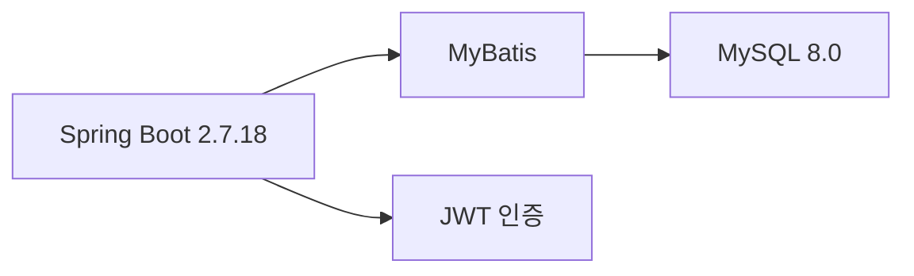

### Frontend
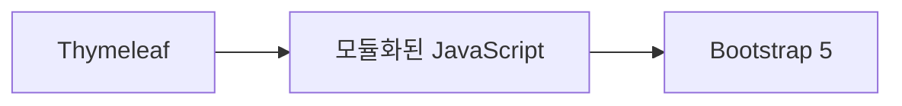

### DevOps
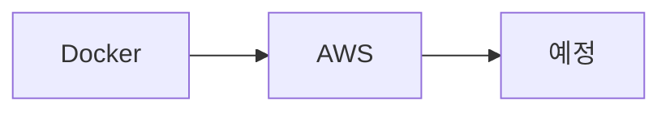

## 3. 핵심 기술 구현 (1분)

### 3.1 이미지 처리 시스템
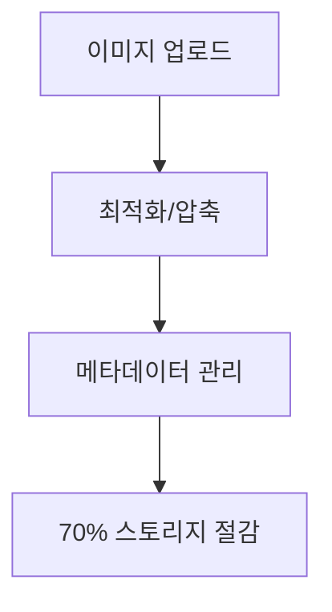

### 3.2 SEO 최적화
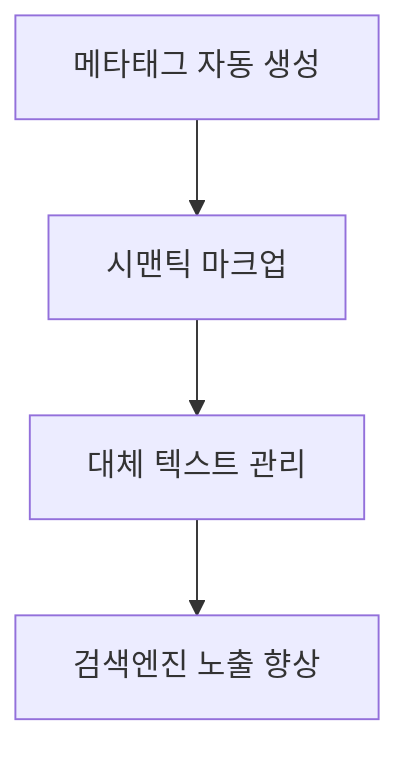

### 3.3 모듈화 아키텍처
#### 완료된 모듈
- 시설 이미지 관리 시스템

#### 진행 중인 모듈
- 회원 권한 관리 시스템

#### 계획된 모듈
- 구인구직 매칭 시스템
- 검색 및 필터링 시스템
- 리뷰/평점 시스템

### 3.4 데이터 관리
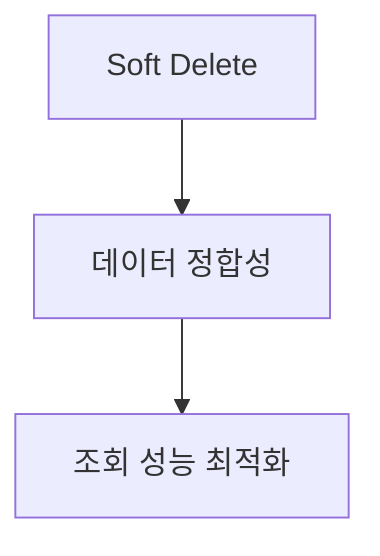

## 4. 프로젝트 특징 (30초)

### 4.1 사용자 중심 설계
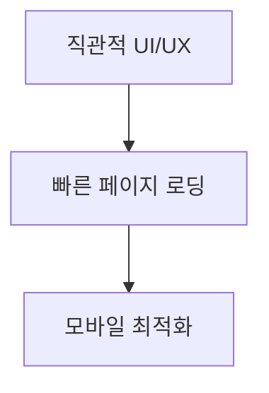

### 4.2 확장성
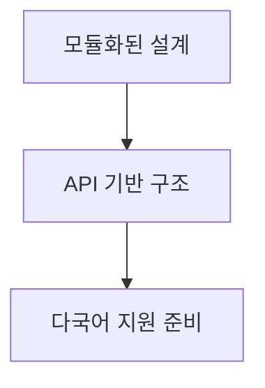

### 4.3 유지보수성
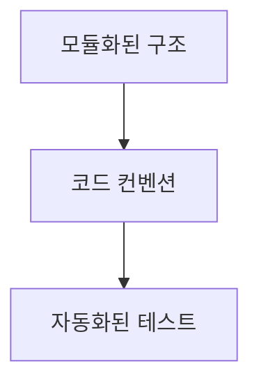

## 5. 발전 계획 (30초)

### Phase 1 (2025.07)
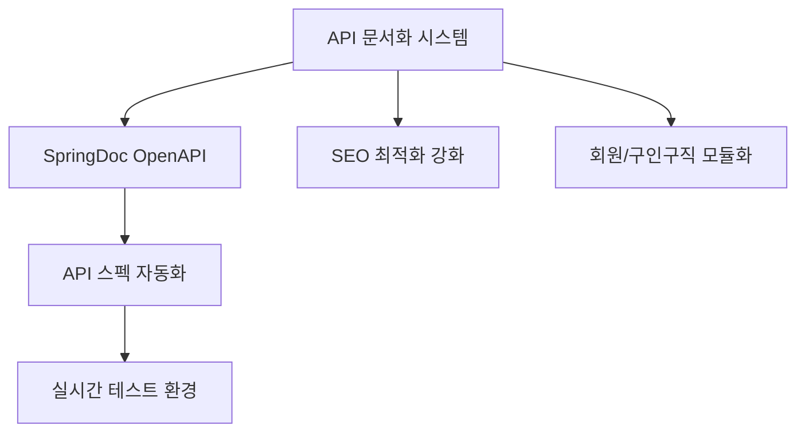

### Phase 2 (2025.08)
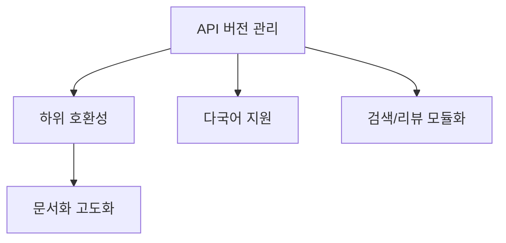

### Phase 3 (2025.09)
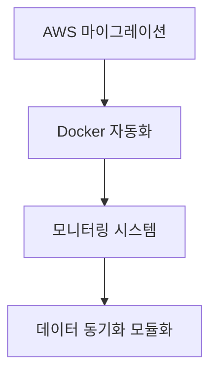