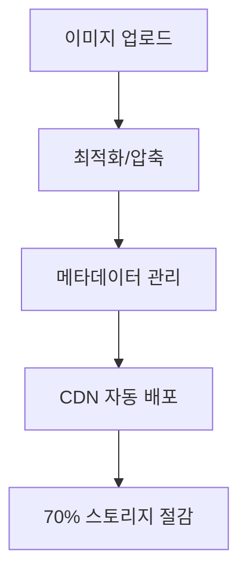
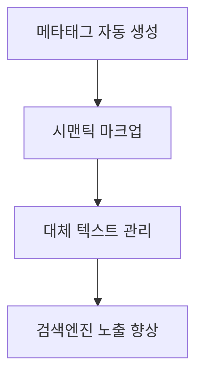
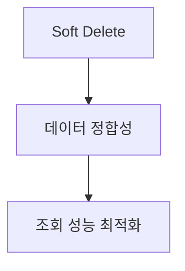
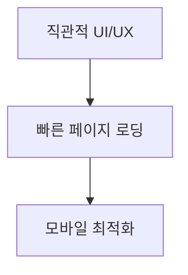
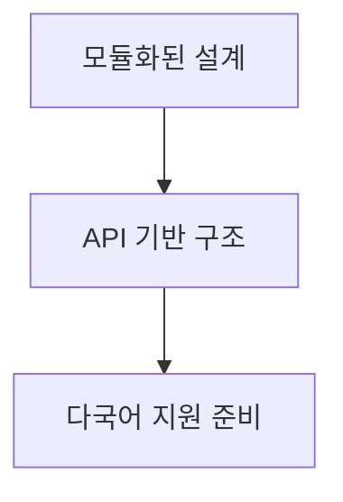
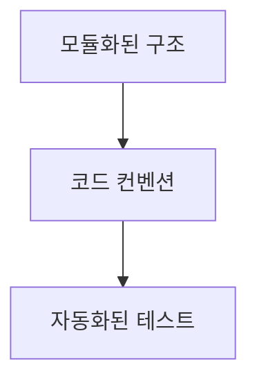
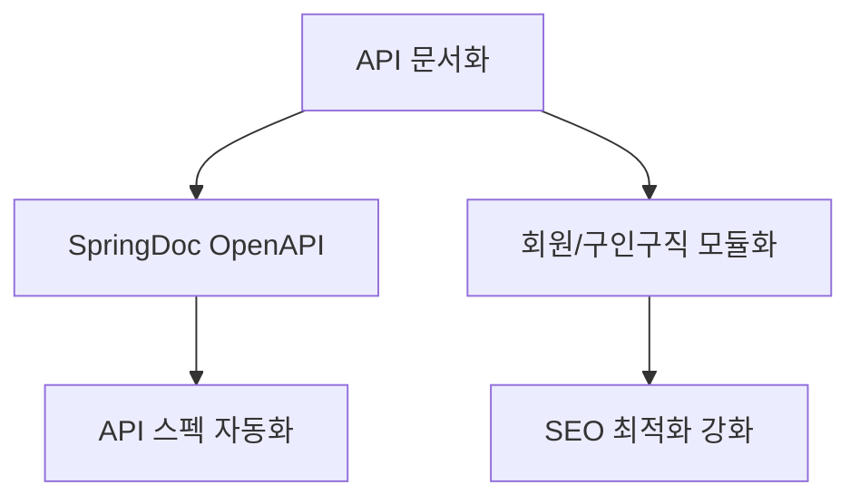
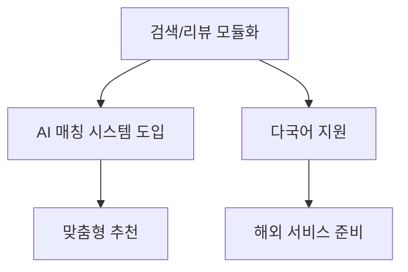
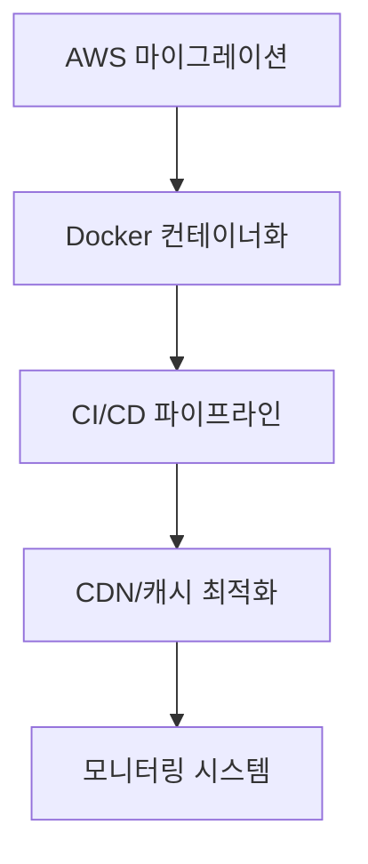
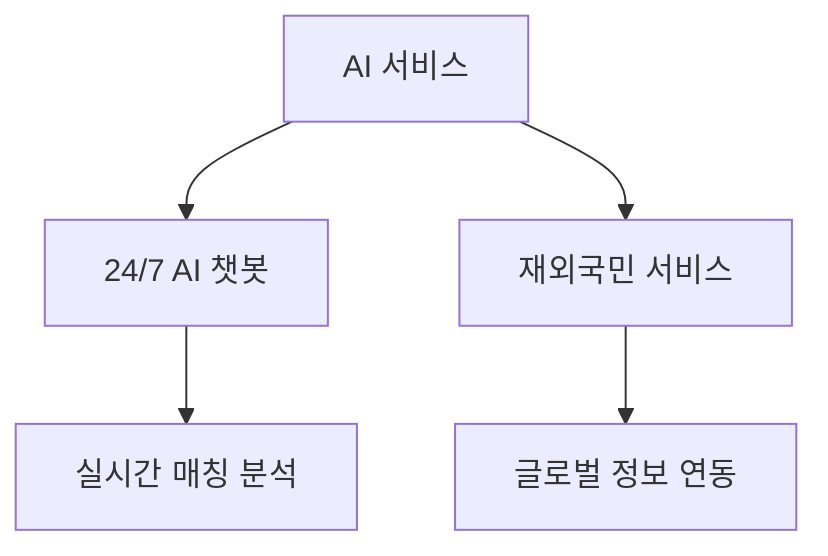

## 3. 핵심 기술 구현 (1분)

### 3.1 이미지 처리 시스템

#### 이미지 최적화 프로세스
- 이미지 압축 및 포맷 최적화
- WebP 변환 및 반응형 이미지
- CDN 기반 글로벌 캐싱
- 지역별 엣지 서버 활용

### 3.2 SEO 최적화

### 3.3 모듈화 아키텍처
#### 완료된 모듈
- 시설 이미지 관리 시스템

#### 진행 중인 모듈
- 회원 권한 관리 시스템

#### 계획된 모듈
- 구인구직 매칭 시스템
- 검색 및 필터링 시스템
- 리뷰/평점 시스템

### 3.4 데이터 관리

## 4. 프로젝트 특징 (30초)

### 4.1 사용자 중심 설계

### 4.2 확장성

### 4.3 유지보수성

## 5. 발전 계획 (30초)

### Phase 1: 기반 시스템 고도화 (2025.07)

### Phase 2: 서비스 확장 (2025.08)

### Phase 3: 인프라 구축 (2025.09)

### Phase 4: 글로벌/AI 서비스 (2025.10)

#### 주요 목표별 세부 계획

##### 시스템 안정화
- API 버전 관리 및 하위 호환성 보장
- 데이터 동기화 및 백업 자동화
- CDN 기반 글로벌 전송 최적화
- 성능 모니터링 및 최적화

##### AI 서비스 고도화
- 사용자 선호도 기반 매칭 알고리즘
- 챗봇 상담 서비스 지능화
- 실시간 매칭 성공률 분석

##### 글로벌 서비스 확장
- 글로벌 요양 시설 정보 통합
- 해외안전여행 정보 실시간 연동
- 재외공관 연계 서비스 구축
- 다국어 서비스 지원